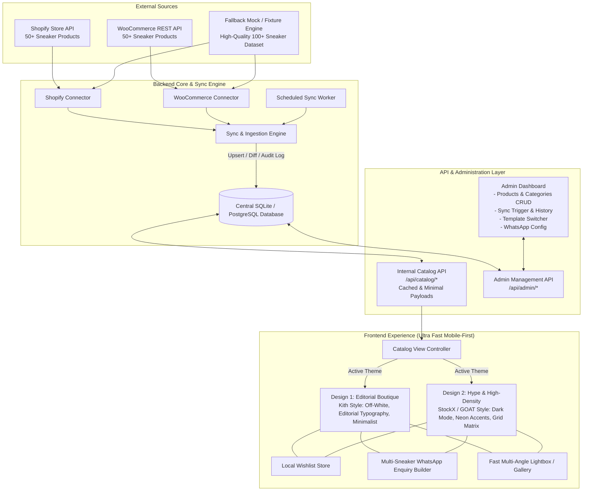
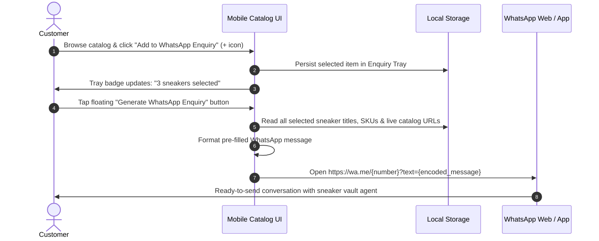
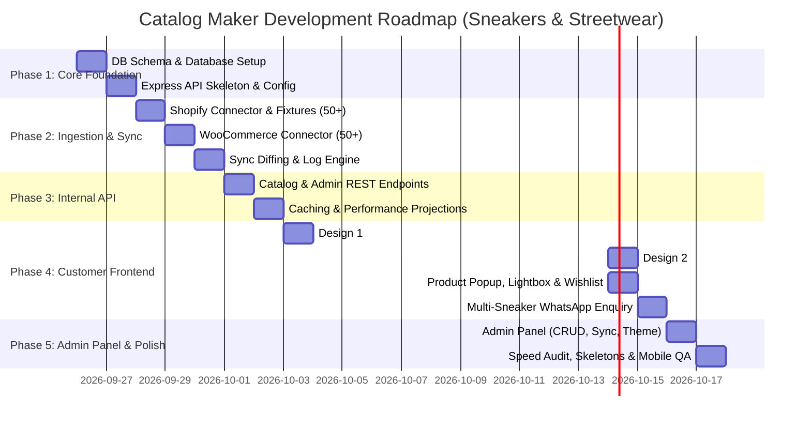

# Catalog Maker: High-Speed Product Catalog Platform
## Technical Architecture, Requirement Analysis & Implementation Plan
**Product Domain:** Premium Sneakers & Streetwear (Limited Drops, Retro Runners, High-Tops, Designer Collaborations)

---

### Executive Summary & Core Objective
The goal is to engineer **Catalog Maker**, an ultra-fast, mobile-first product catalog platform. It bridges external e-commerce platforms (Shopify and WooCommerce) via an **Import & Sync Engine** into a high-performance **Central Product Database**, served through an **Internal Catalog API** to a customer-facing frontend.

**Key Mandate:** Customer browsing must **NEVER** query Shopify or WooCommerce in real-time. Speed, responsiveness, zero-friction WhatsApp conversions (no cart/checkout, no customer login), and multi-theme rendering are paramount.

---

## 1. Complete Requirement Analysis & Mapping

| Requirement Section | Specification from PDF | Architectural Solution for Premium Sneakers & Streetwear |
| :--- | :--- | :--- |
| **1. Primary Objective & Speed** | Reusable, mobile-first catalog platform; speed across category browsing, product popups, lightbox, and WhatsApp inquiries. | Decoupled client-server architecture, local cached database, sub-50ms API responses, responsive WebP sneaker photography, skeleton states. |
| **2. Reference Experience** | Rajdhani catalog UX pattern: category tabs, quick view modal, high-res lightbox, wishlist, WhatsApp multi-select. | Interactive modal/sheet sneaker preview (lateral/medial angles, box condition), pinch/zoom lightbox, floating multi-select inquiry tray. |
| **3. Architecture Pipeline** | `Sources (Shopify/WooCommerce)` → `Import & Sync Engine` → `Internal DB` → `Internal API` → `Fast Mobile Frontend`. | Isolated worker/service modules for connectors; unified intermediate schema; read-optimized internal API. |
| **4. Mandatory Data Sources** | Live API integration with both Shopify & WooCommerce. ≥50 demo products in each environment. | Modular adapters (`ShopifyAdapter`, `WooCommerceAdapter`) with real API credentials + built-in fallback mock seed engines to guarantee 50+ rich sneaker & apparel items each (100+ total). |
| **5. Product Fields** | Name, SKU, Price, Images, Description, Category/Subcategory, Stock/Availability, Variants, Source URL, Metadata. | Normalized relational schema: SKU (e.g., `NK-AJ1-HIGH-CHIC`), silhouettes, colorways, size breakdown (US 7–13), materials, condition. |
| **6. Synchronization Engine** | Incremental sync, detect new/modified/removed items, price/inventory updates, error logging, last-sync timestamps. | Hash/timestamp-based diffing, transactional upserts, atomic sync runs recorded in `sync_logs`. Optional cron schedule. |
| **7. Admin Panel (Mandatory)** | Full CRUD on products, categories, pricing, stock, WhatsApp config, theme picker, manual sync trigger, sync history. | Secure, sleek administrative dashboard with real-time feedback, sync logs viewer, and settings controls. |
| **8. Multiple Catalog Designs** | At least 2 substantially different frontend templates selectable from the backend without DB changes. | **Design A (Editorial Boutique / Clean Streetwear)**: Inspired by Kith & Aimé Leon Dore. Off-white canvas, clean editorial typography, luxury minimalist aesthetic.<br>**Design B (Modern Hype / High-Density Matrix)**: Inspired by StockX & GOAT. Sleek dark-mode grid, electric neon accents, quick-size badges, high-tempo drop vibe. |
| **9. Mobile-First Experience** | Touch navigation, fast swipe/tap, readable specs, quick modal details, no customer login required. | Bottom-sheet sneaker inspection drawer, touch swipe multi-angle carousel, sticky multi-sneaker enquiry bar. |
| **10. Catalog & Product Experience** | Search, category filtering, instant modals, image lightbox, related products, WhatsApp enquiry. | Instant filter by silhouette (Retro Runners, High-Tops, Low-Tops, Skate, Apparel), search by colorway/SKU, related drops. |
| **11. WhatsApp Conversion** | Primary conversion funnel. Pre-filled multi-product inquiry message with direct URLs & SKU details. | Sticky inquiry floating tray showing selected sneakers; generates formatted `https://wa.me/{number}?text={encoded}` with sizes & SKUs. |
| **12. Wishlist** | Account-free wishlist with client-side persistence. | `localStorage` / `IndexedDB` with custom reactive store, heart count badge, and one-tap export to WhatsApp inquiry. |
| **13. Image Architecture** | Thumbnail/preview strategy, responsive WebP loading, lazy loading, fallback placeholders. | Multi-angle sneaker gallery optimization, progressive blur/skeleton placeholders, CDN/R2 ready. |
| **14. Speed Architecture** | Skeleton screens, minimal payloads, indexed queries, zero layout shift (CLS), prefetching. | Pre-warmed cache, lightweight JSON projections (omitting heavy descriptions in list views), CSS containment. |
| **15. Internal Catalog API** | Dedicated clean REST API independent of external formats (`/api/catalog/...`). | RESTful endpoints with field filtering, cursor/offset pagination, and ETag/Cache-Control headers. |
| **16. Reliability & Edge Cases** | External source downtime must not break catalog; sync failures rollback cleanly; missing images show fallback; no raw errors to user. | Circuit breaker for syncs, fallback shoe silhouette placeholder (`placeholder.svg`), graceful empty/out-of-stock states. |
| **17. Multi-Tenant Readiness** | One-client implementation, but decoupled architecture ready for multi-client (`tenant_id`). | Include optional `client_id` / `tenant_id` columns in core tables so multi-tenancy is plug-and-play. |

---

## 2. System Architecture Diagram



---

## 3. Technology Stack

| Layer | Chosen Technology | Rationale |
| :--- | :--- | :--- |
| **Runtime & Framework** | **Node.js + Express** (or Next.js Fullstack) | Proven, lightweight, sub-millisecond execution, robust background sync jobs and REST APIs. |
| **Database & ORM** | **SQLite (via Prisma or better-sqlite3)** | Zero-latency local file queries (<2ms response time), zero external DB connection lag, structured for PG migration. |
| **Image Processing** | **Sharp / Modern WebP Transcoder** | Generates lightweight thumbnails, compresses sneaker photo angles by 75%, supports progressive loading. |
| **Frontend Styling** | **Vanilla CSS + Modern Design Tokens (CSS Variables)** | Zero CSS-in-JS runtime overhead, instant CSS paint times, instant theme switching between Design 1 and Design 2. |
| **State & Storage** | **Client-side Native Reactive Store + LocalStorage** | Zero login required for Wishlist & WhatsApp inquiry selection basket. Survives browser refresh. |
| **Icons & Media** | **Feather / Lucide SVG Icons** (inline) | Zero external webfont render-blocking latency. |

---

## 4. Database Schema Design (Tailored for Sneakers & Streetwear)

```sql
-- 1. Configuration & Store Settings
CREATE TABLE catalog_settings (
    id INTEGER PRIMARY KEY DEFAULT 1,
    store_name TEXT NOT NULL DEFAULT 'KICKS & CO. | Sneaker Vault',
    whatsapp_number TEXT NOT NULL DEFAULT '+919876543210',
    whatsapp_default_message TEXT DEFAULT 'Hi, I am interested in these sneakers from your catalog:',
    active_theme TEXT NOT NULL DEFAULT 'editorial_boutique', -- 'editorial_boutique' or 'hype_matrix'
    currency_symbol TEXT DEFAULT '₹',
    allow_out_of_stock_enquiry INTEGER DEFAULT 1,
    client_id TEXT DEFAULT 'client_default',
    updated_at TIMESTAMP DEFAULT CURRENT_TIMESTAMP
);

-- 2. Categories / Silhouettes
CREATE TABLE categories (
    id TEXT PRIMARY KEY,
    name TEXT NOT NULL, -- e.g., 'Retro High-Tops', 'Low-Top Classics', 'Running & Lifestyle', 'Skate & Canvas', 'Collabs & Grails'
    slug TEXT UNIQUE NOT NULL,
    description TEXT,
    image_url TEXT,
    display_order INTEGER DEFAULT 0,
    is_active INTEGER DEFAULT 1,
    parent_id TEXT,
    created_at TIMESTAMP DEFAULT CURRENT_TIMESTAMP,
    FOREIGN KEY (parent_id) REFERENCES categories(id)
);

-- 3. Products (Sneakers & Apparel)
CREATE TABLE products (
    id TEXT PRIMARY KEY,
    title TEXT NOT NULL, -- e.g., 'Air Jordan 1 Retro High OG Chicago Lost & Found'
    slug TEXT UNIQUE NOT NULL,
    sku TEXT UNIQUE, -- e.g., 'DZ5485-612'
    description TEXT,
    short_description TEXT,
    price REAL NOT NULL,
    compare_at_price REAL,
    category_id TEXT NOT NULL,
    source_platform TEXT NOT NULL, -- 'shopify', 'woocommerce', 'manual'
    source_id TEXT,
    source_url TEXT,
    stock_status TEXT DEFAULT 'in_stock', -- 'in_stock', 'out_of_stock'
    stock_quantity INTEGER DEFAULT 10,
    is_active INTEGER DEFAULT 1,
    is_featured INTEGER DEFAULT 0,
    metadata JSON, -- stores sizes (US 7, 7.5, 8... 12), colorway ('Varsity Red/Black/Sail'), silhouette, release_year
    created_at TIMESTAMP DEFAULT CURRENT_TIMESTAMP,
    updated_at TIMESTAMP DEFAULT CURRENT_TIMESTAMP,
    FOREIGN KEY (category_id) REFERENCES categories(id)
);

-- 4. Product Images (Multi-Angle Sneaker Photography)
CREATE TABLE product_images (
    id TEXT PRIMARY KEY,
    product_id TEXT NOT NULL,
    original_url TEXT NOT NULL, -- Lateral view, Medial view, Outsole, Toe box, Heel
    thumbnail_url TEXT,
    alt_text TEXT,
    display_order INTEGER DEFAULT 0,
    is_primary INTEGER DEFAULT 0,
    FOREIGN KEY (product_id) REFERENCES products(id) ON DELETE CASCADE
);

-- 5. Synchronization Logs
CREATE TABLE sync_logs (
    id TEXT PRIMARY KEY,
    source_platform TEXT NOT NULL, -- 'shopify' or 'woocommerce'
    status TEXT NOT NULL, -- 'started', 'completed', 'failed'
    products_imported INTEGER DEFAULT 0,
    products_updated INTEGER DEFAULT 0,
    products_skipped INTEGER DEFAULT 0,
    error_message TEXT,
    started_at TIMESTAMP DEFAULT CURRENT_TIMESTAMP,
    completed_at TIMESTAMP
);

-- Indexes for Speed Performance
CREATE INDEX idx_products_category ON products(category_id, is_active);
CREATE INDEX idx_products_search ON products(title, sku, price);
CREATE INDEX idx_images_product ON product_images(product_id, display_order);
```

---

## 5. Internal Catalog API Specification

| Endpoint | Method | Purpose & Performance Optimization |
| :--- | :--- | :--- |
| `/api/catalog/config` | `GET` | Returns store metadata, active theme (`editorial_boutique` vs `hype_matrix`), WhatsApp number, currency. Cached with ETag. |
| `/api/catalog/categories` | `GET` | Returns active categories ordered by `display_order` with product counts. |
| `/api/catalog/products` | `GET` | Filter by `category_id`, search `query`, pagination (`page`, `limit`), sort (`price_asc`, `newest`). Returns minimal payload (thumbnails, title, SKU, price, sizes, stock status). |
| `/api/catalog/products/:idOrSlug`| `GET` | Detailed product payload including all multi-angle image gallery URLs, colorway details, available sizes, and related sneakers. |
| `/api/catalog/products/batch` | `POST` | Accepts list of IDs (e.g. from wishlist or multi-select tray) and returns preview objects in a single batch trip. |
| `/api/admin/sync/run` | `POST` | Triggers import/sync engine for Shopify, WooCommerce, or both. |
| `/api/admin/sync/history` | `GET` | Returns chronological sync log, count of items imported/updated, and any error traces. |
| `/api/admin/products` | `POST/PUT/DELETE`| Admin CRUD operations for manual adjustments. |
| `/api/admin/settings` | `PUT` | Updates active catalog design, WhatsApp number, and configuration. |

---

## 6. Frontend Experiences: Two Substantially Different Catalog Designs

### Design 1: "Editorial Boutique" (Inspired by Kith & High-End Streetwear)
- **Aesthetic:** High-fashion streetwear editorial. Clean off-white/bone background (`#F9F9F8`), crisp serif & clean sans headers (`Instrument Serif` + `Inter`), muted clay/slate secondary accents.
- **Card Layout:** Vertical gallery cards with soft shadows, hover angle shift (swaps from profile to top-down view), subtle floating wishlist icon, quick size pill preview.
- **Navigation:** Horizontal scrollable category pill bar with smooth sliding indicator; sticky header with inquiry drawer badge count.
- **Product Experience:** Slide-up bottom sheet with swipeable multi-angle image carousel, quick-select size tags (US 8, 9, 10, etc.), and 1-click WhatsApp enquiry.

### Design 2: "Hype & High-Density Matrix" (Inspired by GOAT & StockX)
- **Aesthetic:** Dark-mode cyber sneaker vault (`#090D16` / `#131B2E`), bold typography (`Syne` / `Plus Jakarta Sans`), electric volt / hyper-orange conversion accents (`#FF5500` / `#00FF88`).
- **Card Layout:** Compact dual-column mobile matrix, SKU badges, verified authenticity stamp, fast-tap multi-select checkboxes for batch WhatsApp quotes.
- **Navigation:** Segmented category bar with counter badges; instant keyword filter bar with auto-clear.
- **Product Experience:** Side-drawer split view, full-width high-res image stack, SKU copy chip, and instant compare bar.

---

## 7. WhatsApp Conversion Engine Workflow



### Pre-filled WhatsApp Message Template
```text
Hi, I am interested in the following sneakers from your catalog:

1. Air Jordan 1 Retro High OG 'Chicago Lost & Found'
   - SKU: DZ5485-612
   - Price: ₹24,999
   - Link: https://catalog.example.com/p/air-jordan-1-chicago-lost-found

2. Travis Scott x Air Jordan 1 Low 'Reverse Mocha'
   - SKU: DM7866-162
   - Price: ₹62,000
   - Link: https://catalog.example.com/p/travis-scott-jordan-1-reverse-mocha

3. New Balance 990v6 Made in USA 'Grey'
   - SKU: M990GL6
   - Price: ₹19,999
   - Link: https://catalog.example.com/p/new-balance-990v6-grey

Please share availability for size US 9.5 and shipping details.
```

---

## 8. Mandatory Demonstration Checklist Mapping (Section 19)

We will ensure every single item from the PDF evaluation checklist is explicitly fulfilled:

1. [x] **Admin Panel:** Complete management portal for catalog settings, sneakers, categories, sync controls.
2. [x] **Add/Edit Products:** Interactive UI to create new items or modify title, SKU, images, and description.
3. [x] **Create Categories:** Manage silhouettes/categories (e.g., Retro High-Tops, Runners, Skate, Collabs).
4. [x] **Change Pricing & Availability:** Instant toggles for in-stock / out-of-stock and price editing.
5. [x] **Import 50+ Shopify Products:** Working adapter connected to Shopify REST/GraphQL API + 50 rich sneaker fixture dataset.
6. [x] **Import 50+ WooCommerce Products:** Working adapter connected to WooCommerce REST API v3 + 50 rich streetwear fixture dataset.
7. [x] **Show Internal Database:** Admin DB viewer / API inspection endpoint proving all 100+ items live in local DB.
8. [x] **Run Synchronization:** One-click manual sync button with real-time progress & error logging.
9. [x] **Show Source Product Update Reflected:** Modify a source price/stock → run sync → observe updated values in catalog.
10. [x] **Demonstrate 2 Catalog Designs:** Design 1 (Editorial Boutique) & Design 2 (Hype Matrix).
11. [x] **Switch Active Design from Backend:** Radio switch in Admin Settings immediately swaps frontend layout.
12. [x] **Browse Categories & Products:** Smooth filtering, zero page reloads, responsive category chips.
13. [x] **Product Pop-up & Image Lightbox:** Modal product card with zoomable multi-angle sneaker lightbox.
14. [x] **Use Wishlist:** Heart sneakers, view wishlist page/drawer, persists on reload without login.
15. [x] **Select Multiple Products:** Checkbox/tray selection for batch inquiry.
16. [x] **Generate WhatsApp Enquiry:** Formats structured WhatsApp inquiry URL with store WhatsApp number.
17. [x] **Demonstrate on Mobile:** Fully responsive viewport testing, touch targets >44px, bottom sheet interactions.
18. [x] **Skeleton / Loading & Fast Navigation:** Zero blank screens; elegant animated skeletons during API fetches.

---

## 9. Implementation Roadmap & Milestones



### Detailed Execution Phases

- **Phase 1: Project Setup & Database Layer**
  - Initialize project structure with clean separation: `/server`, `/client`, `/shared`.
  - Implement SQLite database with schema for `products`, `categories`, `product_images`, `catalog_settings`, `sync_logs`.
  - Provide seed data setup script.

- **Phase 2: Import & Sync Engine**
  - Implement `ShopifySyncService`: connects to Shopify Admin API / seeded with 50+ iconic sneakers & streetwear drops.
  - Implement `WooCommerceSyncService`: connects to WooCommerce REST API v3 / seeded with 50+ retro runners & apparel.
  - Implement atomic upsert logic: compares timestamps/hashes, detects changes, updates prices/stock, records detailed sync logs.

- **Phase 3: Fast Internal Catalog API**
  - Implement endpoints: `/api/catalog/products`, `/api/catalog/categories`, `/api/catalog/config`, `/api/catalog/products/:id`.
  - Include pagination, category filtering, search, and lightweight payload projections.
  - Add admin endpoints for CRUD, sync triggers, and theme settings.

- **Phase 4: Customer-Facing Frontend & Design System**
  - Build universal catalog shell with dynamic theme-switching capability.
  - Implement **Design 1 (Editorial Boutique - Kith/Aimé Leon Dore aesthetic)**.
  - Implement **Design 2 (Hype & High-Density Grid - StockX/GOAT aesthetic)**.
  - Implement components:
    - Sticky Silhouette / Category Navigation Bar
    - Fast Product Modal / Bottom Sheet
    - Multi-angle Sneaker Lightbox with zoom
    - Wishlist (LocalStorage)
    - Multi-select WhatsApp Enquiry Tray + Direct WhatsApp Link Generator
    - Skeleton Loaders & Progressive Image placeholders

- **Phase 5: Complete Admin Dashboard**
  - Dashboard with summary metrics (Total Products, Categories, Last Sync, Active Theme).
  - Product Manager (Add, Edit, Delete, Stock toggle, Price adjustment).
  - Category Manager (Reorder, create, visibility).
  - Sync Control Center: Manual "Sync Shopify" and "Sync WooCommerce" buttons with live progress, status badges, and historical error logs.
  - Settings: Active Catalog Design toggle, WhatsApp business number, store name.

- **Phase 6: Verification, Speed Optimization & Evaluation Testing**
  - Verify all 18 demonstration points from Section 19 of the PDF.
  - Test on mobile viewports.
  - Ensure zero raw server errors and proper fallback states.
